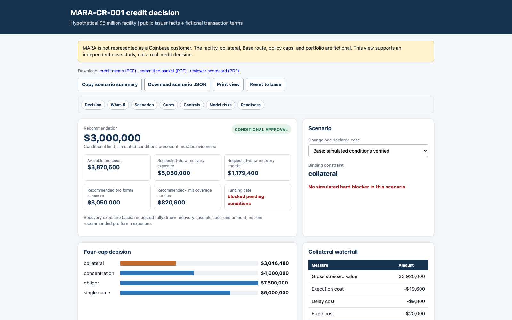

# MARA secured revolver: a credit committee case

[](https://github.com/RahilBhavan/mara-credit-case/actions/workflows/ci.yml)
[](LICENSE)

[](https://rahilbhavan.github.io/mara-credit-case/)

**Live decision view: https://rahilbhavan.github.io/mara-credit-case/**

A credit committee package that sizes a hypothetical $5.0 million, 12-month secured revolver to MARA Holdings from public filings, a tested decision engine, and a fictional collateral schedule.

## The answer

Approve a conditional **$3.0 million** limit against the **$5.0 million** request. Funding stays blocked until nine pre-funding conditions clear, among them verified ownership, a first-priority lien, enforceable control of the collateral, and a tested route from the collateral to repayment cash. If any of those stays unknown, the answer is decline.

The limit is the lowest of four caps, rounded down to the nearest $100,000:

| Cap | Amount | Basis |
|---|---:|---|
| Obligor | $7.50M | Illustrative standalone capacity for the borrower |
| **Collateral** | **$3.05M (binding)** | $3,870,600 stressed proceeds ÷ 1.25x coverage, less $50,000 accrued = $3,046,480 |
| Single-name | $6.00M | Illustrative policy limit for one name |
| Concentration | $4.00M | Shared custody route and sector capacity in the fictional portfolio |

At the $3.0 million limit, pro forma exposure is $3.05 million and coverage is 1.27x. A fully drawn $5.0 million request would leave a $1,179,400 recovery shortfall. The illustrative obligor rating is `3 / Watchful`. It is an ordinal judgment, not a probability of default.

## Key facts from the June 30, 2026 MARA filing

- $421.3 million of cash and cash equivalents. About 30% sits in a majority-owned subsidiary and is designated for its operations.
- 35,577 bitcoin with a $2.1 billion fair value. 4,742 were loaned and 4,528 pledged, leaving 26,307 unrestricted.
- About $2.4 billion of debt, including a $150 million line of credit due within a year, $48.1 million of December 2026 notes, and $291.6 million of notes holders can put in June 2027.
- A static liquidity screen leaves $96.8 million after designated cash and near-term debt, and negative $194.8 million if the June 2027 put is exercised.

These facts frame the borrower. The case does not treat MARA's reported bitcoin as collateral for this facility.

## What's in it

- [Credit memo (PDF)](outputs/credit-memo.pdf): the two-page committee recommendation.
- [Opposing memo (PDF)](outputs/opposing-memo.pdf): the strongest case against the recommendation.
- [Committee packet (PDF)](outputs/committee-packet.pdf): decision, thresholds, conditions, controls, and model risks.
- [Credit model workbook (XLSX)](outputs/credit-model.xlsx): 16 sheets of live formulas, audited cell by cell against the engine.
- [Decision view (HTML)](https://rahilbhavan.github.io/mara-credit-case/): eleven scenarios, a collateral what-if lab, the decision surface, and the condition register.
- [Review package (ZIP)](outputs/review-package.zip): every output plus a start-here guide and a SHA-256 manifest.

## How it's built

- **Engine** (`src/credit_risk/engine.py`): standard-library Python with `Decimal` arithmetic. It reads the case inputs in `data/case/`, runs the collateral waterfall and the four caps for each scenario, and writes `artifacts/decision-record.json` and `artifacts/scenario-results.*`.
- **Evidence**: five public sources are frozen with SHA-256 hashes under `02-research/snapshots/`. `scripts/extract_filing_facts.py` pulls the issuer facts from the filing XBRL and reconciles them to the memo values.
- **Builders**: scripts in `scripts/` and `work/` generate the registers, PDFs, workbook, decision view, and review bundle from the engine output.
- **Tests** (`tests/`): 65 unit tests, including monotonicity checks (more stress never raises the limit) and hard-blocker checks.
- **Validator** (`scripts/validate_package.py`): 49 checks that reconcile the engine, workbook, memos, hashes, and outputs, and report PASS, FAIL, or SKIP for each.

## Run it

Needs Python 3.9 or later.

```bash
pip install -r requirements.txt
PYTHONPATH=src python3 -m unittest discover -s tests
python3 scripts/validate_package.py
python3 scripts/build_package.py
```

`build_package.py` rebuilds every artifact in dependency order, then runs the tests and the validator. The workbook rebuild step uses a non-public spreadsheet tool; from a fresh clone it is skipped and the committed workbook is the source of truth. It also skips the decision-view audit if Node.js is missing. On macOS with `ffmpeg`, add `--with-demo` to rebuild the narrated video.

Evaluate one scenario from the command line:

```bash
PYTHONPATH=src python3 -m credit_risk --case-dir data/case --scenario collateral_down_30
```

## Scope and limits

- MARA is a public-information case only. The facility, collateral, Base route, covenants, policy limits, rating, and portfolio are fictional.
- This is an independent project. It is not affiliated with or endorsed by Coinbase or MARA, and it does not claim MARA is a Coinbase customer.
- No private borrower data, facility documents, lien search, legal opinion, or wallet evidence was reviewed.
- The caps and costs are illustrative, not calibrated credit policy. No independent reviewer has reproduced the numbers yet; `artifacts/external-review-kit.md` describes those checks.

## Project documents

- [Decision brief](01-brief/decision-brief.md) and [design options](03-design/options.md)
- [Architecture](03-design/architecture.md) and [data model](03-design/data-model.md)
- [Source register](02-research/source-register.csv) and [data feasibility](02-research/data-feasibility.md)
- [Validation plan](05-validation/validation-plan.md), [adversarial review](05-validation/adversarial-review.md), and [validation report](artifacts/validation-report.md)
- [Reproducibility guide](artifacts/reproducibility.md) and [feedback log](artifacts/feedback-log.md)
- [Artifact manifest](artifacts/manifest.md)

## Related projects

- [spine](https://github.com/RahilBhavan/spine): live stress test of Coinbase's Morpho loan book on Base.
- [coin-revenue-bridge](https://github.com/RahilBhavan/coin-revenue-bridge): Q3 to Q4 2024 Coinbase consumer revenue bridge from SEC filings.
- [x402-exception-desk](https://github.com/RahilBhavan/x402-exception-desk): synthetic x402 payment exception desk.
- [Crypto finance projects hub](https://rahilbhavan.com/crypto-finance)
